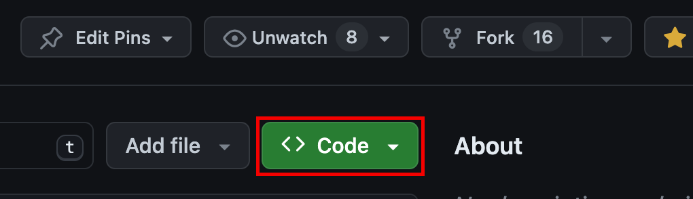
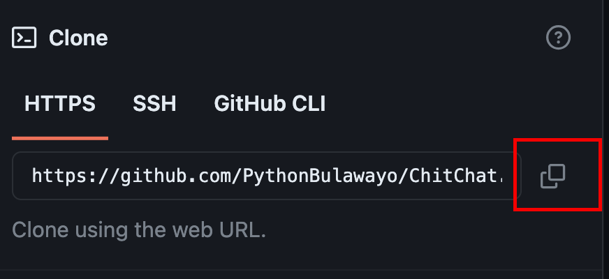

# Project Documentation

[](https://gitpod.io/#https://github.com/PythonBulawayo/ChitChat) 

ChitChat is a Python powered social media platform initiated by Buluwayo Python developers.

The project is built using [Django](https://www.djangoproject.com/) for the backend and [React JS](https://react.dev/) for the frontend. The backend is located in the `backend` folder while the frontend is in the `frontend` folder.


## Installation

Here's how to get yourself started with ChitChat on your machine.

### Backend Initialization

Move into the backend folder from your terminal with the following command

```sh
cd backend
```

Initialize the virtual environment 

```sh
python -m venv venv
```

Activate the virtual environment 

```sh
# Unix
source venv/bin/activate

# Windows
venv\Scripts\activate
```

Install dependencies from the **requirements.txt** text file

```sh
pip install -r requirements.txt
```

### Backend Server Startup

To start your server, run the following commands from the **backend** folder, on your terminal.

Create database migrations from codebase

```sh
python manage.py makemigrations
```

Install the database migration

```sh
python manage.py migrate
```

Create a project super user

```sh
python manage.py createsuperuser
```

Run the server

```sh
python manage.py runserver
```


### Frontend Initialization

Move into the **frontend** folder

```sh
cd frontend
```

Install npm modules

```sh
npm install
```

Run the development server

```sh
npm run dev
```

### Setting Up Docker (Optional)

#### Install Docker on Windows

Download Docker Desktop from the official Docker website: [Docker Desktop for Windows](https://docs.docker.com/desktop/install/windows-install/) 

Follow the on-screen instructions to complete the installation.

Once the installation is complete, Docker Desktop will be running on your system.

#### Install Docker on MacOS

Download Docker Desktop from the official Docker website: [Docker Desktop for Mac](https://docs.docker.com/desktop/install/mac-install/) 

Double-click the installer package to mount the Docker disk image.

Drag the Docker icon to the Applications folder.

Open Docker from the Applications folder and follow the on-screen instructions to complete the installation.

Once the installation is complete, Docker Desktop will be running on your system.

#### Install Docker on Linux

NB: Refer to the official Docker documentation for updates: [Docker Desktop for Linux (Ubuntu)](https://docs.docker.com/engine/install/ubuntu/)

Open a terminal window.

Update the package index:

```sh
sudo apt update
```

Install Docker dependencies:

```sh
sudo apt install apt-transport-https ca-certificates curl software-properties-common
```

Add the Docker GPG key:

```sh
curl -fsSL https://download.docker.com/linux/ubuntu/gpg | sudo gpg --dearmor -o /usr/share/keyrings/docker-archive-keyring.gpg
```

Set up the stable Docker repository:

```sh
echo "deb [arch=amd64 signed-by=/usr/share/keyrings/docker-archive-keyring.gpg] https://download.docker.com/linux/ubuntu $(lsb_release -cs) stable" | sudo tee /etc/apt/sources.list.d/docker.list > /dev/null
```

Update the package index again:

```sh
sudo apt update
```

Install Docker:

```sh
sudo apt install docker-ce docker-ce-cli containerd.io
```

Docker should now be installed on your Linux system. Check if Docker is installed correctly:

```sh
docker --version
```

#### Run the application

To run this project using docker, please follow these steps:

Change to the repository directory on your computer (if you are not already there):

```sh
cd chitchat
```

In this directory you should see a `docker-compose.yaml` file

Then in your terminal, run the following command:

```sh
docker compose up --build
```

This should bring up the entire project. Good luck!

## Contributing

Pull requests are welcome. For major changes, please open an issue first to discuss what you would like to change. Please make sure to update tests as appropriate. This section is a simplified guide to make contributions. Follow the steps below to contribute:

### Fork the repository

Fork this repository by clicking on the fork button on the top of this page. This will create a copy of this repository in your account.


### Clone the repository

The next step is to clone the forked repository to your machine. Go to your GitHub account, open the forked repository, click on the code button and then click the copy to clipboard icon. The copied url should look like this: https://github.com/PythonBulawayo/ChitChat.git





Open a terminal and run the following git command:
```sh
git clone https://github.com/PythonBulawayo/ChitChat.git
```

If you prefer using SSH for Git operations, you can clone the repository using the SSH URL. 

Open a terminal and run the following git command:
```sh
git clone git@github.com:PythonBulawayo/ChitChat.git
```

### Create a branch

Change to the repository directory on your computer (if you are not already there):<br>
```sh
cd chitchat
```

Now create a branch using the git switch command:
```sh
git switch -c your-new-branch-name
```

For example:
```sh
git switch -c update-documentation
```

### Commit your changes

Make necessary changes.

To see the changes you have made, use the git status command:

```sh
git status
```

Add those changes to the branch you just created using the git add command:

```sh
git add the-file-you-made-changes-to
```

For example:

```sh
git add read.md
```

Commit the changes using the git commit command:

```sh
git commit -m "Update README with new information"
```

### Push changes to GitHub

Push your changes using the git push command:

```sh
git push -u origin your-branch-name
```

Replace your-branch-name with the name of the branch you created earlier.

For example:
```sh
git push -u origin update-documentation
```

### Submit your changes for review

If you go to your repository on GitHub, you'll see a Compare & pull request button. Click on that button.

1. Create a pull request

2. Now submit the pull request.

### What next?

**Reviewing your Changes:**

Your changes will thoroughly be reviewed by the collaborator and other contributors in your pull request to ensure that the changes align with the purpose of the pull request.

**Merging the Pull Request:**

Once your pull request has been reviewed and all checks pass, it will be merged into the target branch. 

## License

Licensed under [MIT](./LICENSE.md)
