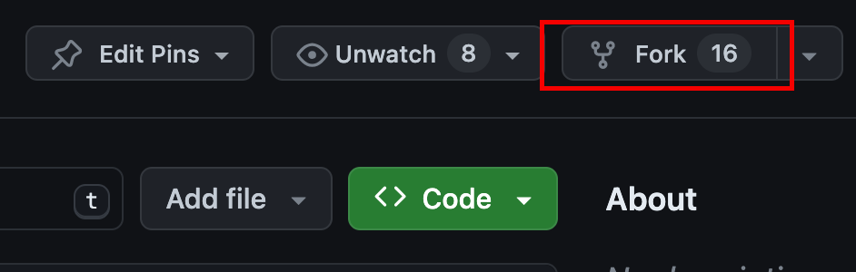

# ChitChat Project Readme

ChitChat is a Python-powered Social Network.

## Installation

### Backend

1. cd into backend folder
    ```cd backend```

2. Create virtual environment
    ### Creating virtual environment
    ```python -m venv venv```

    ### Activating the virtual environment
    ```source venv/bin/activate```

    ### Activating the virtual environment on windows
    ```venv\Scripts\activate```

3. Install dependencies from the requirements text file.<br>
    ```pip install -r requirements.txt```


## Usage
To run this project do the following:

### Migrations

1. Make migrations:<br>
    ```python manage.py makemigrations```

2. Run migrations:<br>
    ```python manage.py migrate```

3. Create super user:<br>
    ```python manage.py createsuperuser```

4. Run the server:<br>
    ```python manage.py runserver```


### FrontEnd
1. cd into the frontend folder
```cd frontend```

2. Install dependencies
```npm install```

3. Run the development server
```npm run dev```


### Docker

#### Install Docker on Windows
1. Download Docker Desktop from the official Docker website:  <a href="https://docs.docker.com/desktop/install/windows-install/">Docker Desktop for Windows</a>
2. Follow the on-screen instructions to complete the installation.

3. Once the installation is complete, Docker Desktop will be running on your system.

#### Install Docker on macOS
1. Download Docker Desktop from the official Docker website: <a href="https://docs.docker.com/desktop/install/mac-install/">Docker Desktop for Mac</a>

2. Double-click the installer package to mount the Docker disk image.

3. Drag the Docker icon to the Applications folder.

4. Open Docker from the Applications folder and follow the on-screen instructions to complete the installation.

5. Once the installation is complete, Docker Desktop will be running on your system.

#### Install Docker on Linux
NB: Refer to the official Docker documentation for updates: <a href="https://docs.docker.com/engine/install/ubuntu/">Get Docker for Linux.</a>

1. Open a terminal window.

2. Update the package index:<br>
    ```sudo apt-get update```

3. Install Docker dependencies:<br>
    ```sudo apt-get install apt-transport-https ca-certificates curl software-properties-common```

4. Add the Docker GPG key:<br>
    ```curl -fsSL https://download.docker.com/linux/ubuntu/gpg | sudo gpg --dearmor -o /usr/share/keyrings/docker-archive-keyring.gpg```

5. Set up the stable Docker repository:<br>
    ```echo "deb [arch=amd64 signed-by=/usr/share/keyrings/docker-archive-keyring.gpg] https://download.docker.com/linux/ubuntu $(lsb_release -cs) stable" | sudo tee /etc/apt/sources.list.d/docker.list > /dev/null```

6. Update the package index again:<br>
    ```sudo apt-get update```

7. Install Docker:<br>
```sudo apt-get install docker-ce docker-ce-cli containerd.io```

Docker should now be installed on your Linux system.


Check if Docker is installed correctly:<br>
    ```docker --version```

#### Run the application
To run this project using docker, please follow these steps:

1. Change to the repository directory on your computer (if you are not already there):<br>
    ```cd chitchat```<br>
    In this directory you should see a file:<br>
     - docker-compose.yaml

2. Then in your terminal, run the following command:<br>
    ```docker compose up --build```

This should bring up the entire project. Good luck!


## Contributing

Pull requests are welcome. For major changes, please open an issue first to discuss what you would like to change. Please make sure to update tests as appropriate. This section is a simplified guide to make contributions. Follow the steps below to contribute:

### Fork the repository

Fork this repository by clicking on the fork button on the top of this page. This will create a copy of this repository in your account.<br>
    

### Clone the repository

The next step is to clone the forked repository to your machine. Go to your GitHub account, open the forked repository, click on the code button and then click the copy to clipboard icon. The copied url should look like this: https://github.com/PythonBulawayo/ChitChat.git<br>
    <br><br>
    

Open a terminal and run the following git command:<br>
    ```git clone https://github.com/PythonBulawayo/ChitChat.git```


### Create a branch

Change to the repository directory on your computer (if you are not already there):<br>
    ```cd chitchat```

Now create a branch using the git switch command:<br>
    ```git switch -c your-new-branch-name```

For example:<br>
    ```git switch -c update-documentation```

### Make necessary changes and commit those changes

1. Make necessary changes.<br>

2. To see the changes you have made, use the git status command:<br>
    ```git status```

3. Add those changes to the branch you just created using the git add command:<br>
    ```git add the-file-you-made-changes-to```

    For example:<br>
    ```git add read.md```

4. Commit the changes using the git commit command:<br>
    ```git commit -m "Update README with new information"```

### Push changes to GitHub

Push your changes using the git push command:<br>
    ```git push -u origin your-branch-name```

Replace your-branch-name with the name of the branch you created earlier.

For example:<br>
    ```git push -u origin update-documentation```

### Submit your changes for review

If you go to your repository on GitHub, you'll see a Compare & pull request button. Click on that button.

1. create a pull request

2. Now submit the pull request.

### What next?

1. Reviewing your Changes:<br>
Your changes will thoroughly be reviewed by the collaborator and other contributors in your pull request to ensure that the changes align with the purpose of the pull request.

2. Merging the Pull Request:<br>
Once your pull request has been reviewed and all checks pass, it will be merged into the target branch. 

## License

[MIT](https://choosealicense.com/licenses/mit/)